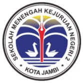
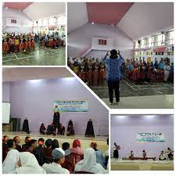
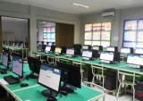
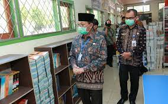
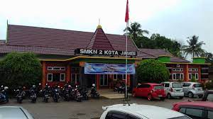
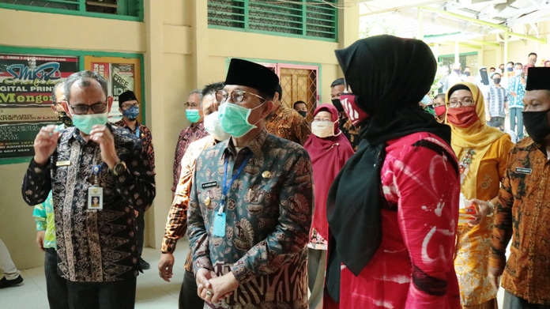
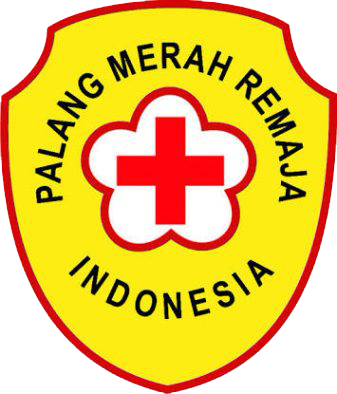
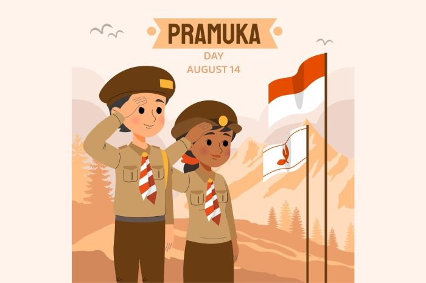
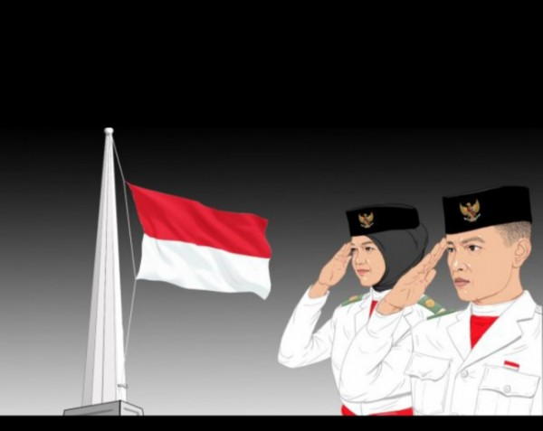

<html>
<head>
	<meta charset="utf-8">
	<meta name="viewport" content="width=device-width, initial-scale=1">
	<title>website</title>
	<link rel="stylesheet" type="text/css" href="style.css">
	<link rel="stylesheet" type="text/css" href="https://cdnjs.cloudflare.com/ajax/libs/font-awesome/5.15.3/css/all.min.css">
	<link rel="icon" type="image/x-icon" href="icon/download.png"/>
</head>
<body>

	<!-- header -->
	

		

			<ul>
				<li><a href="https://youtube.com/c/SMKN2KOTAJAMBI"><i class="fab fa-youtube"></i></a></li>
				<li><a href="https://instagram.com/smeandajbi?utm_medium=copy_link"><i class="fab fa-instagram"></i></a></li>
				<li>Jl.Kopral Ramli, Pasir Putih, Kec.Jambi Sel.Kota Jambi</li>
			</ul>
		

	

	<header>
	

				<h1>SMK NEGERI 2 KOTA JAMBI</h1>
				<ul>
					<li class="active"><a href="sejarah.html">Profil</a></li>
					<li><a href="kejuruan.html">Kompetensi Keahlian</a></li>
					<li><a href="informasi.html">Ekstrakulikuler</a></li>
				</ul>
	
	</header>

	<!-- gambar -->
	<section class="gambar">
		<h2>Smeanda Jambi</h2>
		

	</section>

	<!-- tentang -->
	<section class="tentang">
		

			<h3>Sejarah Singkat Smk Negeri 2 Kota Jambi</h3>
			

			
Sekolah Menengah Kejuruan Negeri 2 kota Jambi dahulu bernama Sekolah Menengah Ekonomi Tingkat Atas (SMEA), terhitung mulai tanggal : 1 Agustus 1965 yang didasarkan pada Surat Keputusan Menteri Pendidikan Dasar dan Kebudayaan Republik Indonesia tanggal : 19 November 1965 Nomor : 748/B.3/Kedj namun belum memiliki gedung sendiri.

			
Berdasarkan Surat Keputusan Deputy Penguasa Pelaksanaan Dwikora Daerah Jambi, Nomor : KEP-003/IV/DPPDD/66 tanggal 06 Juni 1966, tentang Penggunaan Gedung Sekolah Asing yang diambil alih oleh Deputy Pepelrada Jambi, untuk dimanfaatkan oleh Sekolah – sekolah yang belum memiliki Gedung, maka SMEA Negeri 2 Jambi ditunjuk untuk menempati bangunan tersebut pada pagi hari sebanyak 9 ruang dan pada tahun Anggaran 1969/1970  SMEA Negeri 2 Jambi, mendapat tambahan sebanyak 2 (dua) ruang yang sekarang digunakan oleh Kandep Dikbud Kecamatan Jambi Timur Kodya Jambi.

		

	</section>

	<!-- VisiMisi -->
	<section class="VisiMisi">
		

			<h3>Visi & Misi </h3>
			
Visi:

Menjadikan Sekolah Menengah Kejuruan (SMK) Negeri 2 Kota Jambi sebagai Lembaga Diklat terpadu bertaraf Internasional berbasis Teknologi Informasi dan Komunikasi dalam mengantisipasi tuntutan Era Global.

            
Misi:

Misi SMK Negeri 2 Kota Jambi adalah:

1.Menghasilkan tenaga kerja tingkat menengah yang professional, memiliki Iman dan Taqwa, berjiwa entrepreneur serta mampu bersaing di Era Global.

2.Meningkatkan keterampilan Teknologi Informasi dan Komunikasi serta menguasai bahasa asing sehingga mampu bersaing di dunia Internasional.

3.Mengembangkan fungsi SMK sebagai pusat belajar, Informasi Bisnis dan Seni Budaya daerah dalam upaya menanamkan jati diri bangsa

		

	</section>

	<!-- galeri -->
	<section class="galeri">
		

			

				<h3>Galeri</h3>
				
				
				
				
				
			

		

	</section>

	<!-- alamat -->
	<section class="alamat">
		

			<h3>Peta Lokasi</h3>
			<iframe src="https://www.google.com/maps/embed?pb=!1m18!1m12!1m3!1d3988.2237697049413!2d103.64191751475441!3d-1.6199241988187196!2m3!1f0!2f0!3f0!3m2!1i1024!2i768!4f13.1!3m3!1m2!1s0x2e25888b1224749f%3A0xba13725b9daf95ba!2sSekolah%20Menengah%20Kejuruan%20Negeri%202%20Kota%20Jambi!5e0!3m2!1sid!2sid!4v1646634987496!5m2!1sid!2sid" width="600" height="450" style="border:0;" allowfullscreen="" loading="lazy"></iframe>
		

	</section>

	<!-- footer -->
	<footer>
		

		<small>Copy Right &copy;2022. By Donny Agus Saputra Manullang</small>
		

	</footer>

</body>
</html>

<!DOCTYPE html>
<html>
<head>
	<meta charset="utf-8">
	<meta name="viewport" content="width=device-width, initial-scale=1">
	<title>website</title>
	<link rel="stylesheet" type="text/css" href="style.css">
	<link rel="stylesheet" type="text/css" href="https://cdnjs.cloudflare.com/ajax/libs/font-awesome/5.15.3/css/all.min.css">
	<link rel="icon" type="image/x-icon" href="icon/download.png"/>
</head>
<body>

	<!-- header -->
	

		

			<ul>
				<li><a href="https://youtube.com/c/SMKN2KOTAJAMBI"><i class="fab fa-youtube"></i></a></li>
				<li><a href="https://instagram.com/smeandajbi?utm_medium=copy_link"><i class="fab fa-instagram"></i></a></li>
				<li>Jln.Gelatik Kel.Pasir Putih Kode Pos:36139 Kota Jambi</li>
			</ul>
		

	

	<header>
		

				<h1><a href="website.html">SMK NEGERI 2 KOTA JAMBI</a></h1>
				<ul>
					<li class="active"><a href="sejarah.html">Profil</a></li>
					<li><a href="kejuruan.html">Kompetensi Keahlian</a></li>
					<li><a href="informasi.html">Ekstrakulikuler</a></li>
				</ul>
		

	</header>

	<!-- ekskul -->
				<section class="judul">
					

						<h1>EKSTRAKULIKULER</h1>
					

					
				</section>

	   		<section class="pmr">
	   			

	   				<h4>Palang Merah Remaja(PMR)</h4>
	   				

	   				
Palang Merah Remaja (PMR) adalah suatu bagian dari Palang Merah Indonesia yang anggota – anggota didikan ditempa menjadi insan yang berguna bagi semua umat manusia, membantu melaksanakan tugas kepalang merahan, meningkatkan keterampilan dan diharapkan kelak menjadi insan yang berguna bagi semua umat manusia dan dapat menjadi anggota Palang Merah yang baik.Sistem pendidikan Palang Merah Remaja tidak terbatas bagi para anggotanya, akan tetapi diikuti oleh organisasi – organisasi lainnya, karena sifat kenetralanya didalam segala usahanya itu menjadi jaminan untuk tidak melakukan persaingan dengan organisasi – organisasi lain di luar Palang Merah Remaja. Menjadi kewajiban Palang Merah Remaja untuk senantiasa bekerja sama semua golongan menghadapi tugas – tugas kemanusiaan.Walaupun keanggotaan Palang Merah Remaja terbuka bagi setiap remaja, namun sejak semula dan menurut sejarahnya, justru Palang Merah Remaja di Indonesia dimulai dan diadakan dilingkungan sekolah – sekolah. Disamping itu sekolah merupakan sumber daya yang tidak akan putus.Para guru sebagai tenaga ahli di bidang pendidikan sudah sewajarnya mendapat kedudukan terhormat sebagai pembina Palang Merah Remaja yang akan membimbing mereka kelak menjadi insan yang berguna dan memberikan kesibukan dengan kegiatan – kegiatan yang positif di waktu – waktu yang telah di tetapkan diluar jadwal kegiatan belajar mengajar dengan kegiatan – kegiatan yang bermanfaat sekaligus dapat mengurangi meningkatnya kenakalan remaja.Palang Merah Remaja Unit SMK Negeri 2 Kota Jambi, merupakan bagian dari Palang Merah Remaja (PMR) di kota Jambi dan merupakan kegiatan ekstrakulikuler yang berada dilingkungan SMK Negeri 2 Kota Jambi yang bertujuan untuk mendidik siswa dengan kegiatan kepalang merahan.

	   			

	   			
	   		</section>

	   		<section class="pramuka">
	   			

	   				<h4>Pramuka</h4>
	   				

	   				
Pramuka sebagai kegiatan ekstrakulikuler di sekolah tentunya tidak asing lagi bagi hampir semua orang. Belakangan ini pramuka mungkin kurang diminati sebagian siswa karena dianggap ketinggalan jaman, namun bila diikuti akan terasa begitu banyak manfaatnya.

	   				
Sebagian orang masih beranggapan bahwa pramuka itu hanya tepuk tangan, baris berbaris, tali temali. Padahal pramuka itu bersifat fleksibel dalam arti dapat berkembang mengikuti jaman.

	   				
Beberapa manfaat yang dapat dirasakan oleh siswa yang sudah mengikuti pramuka antara lain:

	   				
- Kemandirian

	   				
Misalkan suatu saat kita mengalami kecelakaan di tempat terpencil jauh dari pemukiman, pramuka mengajarkan P3K, tali temali, dsb.

	   				
- Mendapat keluarga baru

	   				
 Tidak hanya di sekolah, di kota, di Indonesia, bahkan di duniapun berkat “pramuka” , orang sedunia bisa bertemu seperti Jambore Dunia.

	   				
- Lebih mencintai Lingkungan

	   				
Bagaimana pramuka mengajarkan tentang lingkungan alam besreta pelestariannya, mengenal flora dan fauna. Lewat penjelejahan alam bebas pramuka diajarkan untuk lebih akrab dengan alam.

	   			

	   		</section>

	   		<section class="pask">
	   			
 
	   				<h4>Paskibra</h4>
	   				

	   				
Paskibra adalah pasukan pengibar bendera. Kegiatan ekstrakurikuler ini bertujuan untuk memperdalam dan memperluas pengetahuan para siswa, dalam arti memperkaya pelajaran serta memperbaiki pengetahuan para siswa yang berkaitan dengan program kurikulum yang ada, dan untuk melengkapi upaya pendidikan, pemantapan dan pembentukan nilai-nilai kepribadian para siswa. Hal ini dapat diusahakan melalui kegiatan baris berbaris, penguasaan teknis upacara bendera, kegiatan yang berkaitan dengan peningkatan ketakwaan terhadap tuhan yang maha esa serta latihan kepemimpinan dan bela negara. Selain itu juga kegiatan ini berorientasi pada mata pelajaran yang diprogramkan, dan usaha pembentukan kepribadian siswa, memperbanyak kagiatan ekstrakurikuler yang diarahkan untuk membina serta meningkatkan bakat. Minat dan keterampilan. Hasil yang diharapakan kegiatan ini tak lain ialah untuk memacu anak kearah yang sifatnya positif khususnya bagi siswa SMK Negeri 2 Kota Jambi.

	   			

	   			
	   		</section>

	   		<section class="selesai">
	   			

	   				<footer>
	   					<small>Copy Right &copy;2022. By Donny Agus Saputra Manullang</small>
	   				</footer>
	   			

	   		</section>
</head>
<body>

</body>
</html>

<!DOCTYPE html>
<html>
<head>
	<meta charset="utf-8">
	<meta name="viewport" content="width=device-width, initial-scale=1">
	<title>website</title>
	<link rel="stylesheet" type="text/css" href="style.css">
	<link rel="stylesheet" type="text/css" href="https://cdnjs.cloudflare.com/ajax/libs/font-awesome/5.15.3/css/all.min.css">
	<link rel="icon" type="image/x-icon" href="icon/download.png"/>
</head>
<body>

	<!-- header -->
	

		

			<ul>
				<li><a href="https://youtube.com/c/SMKN2KOTAJAMBI"><i class="fab fa-youtube"></i></a></li>
				<li><a href="https://instagram.com/smeandajbi?utm_medium=copy_link"><i class="fab fa-instagram"></i></a></li>
				<li>Jln.Gelatik Kel.Pasir Putih Kode Pos:36139 Kota Jambi</li>
			</ul>
		

	

	<header>
		

				<h1><a href="website.html">SMK NEGERI 2 KOTA JAMBI</a></h1>
				<ul>
					<li class="active"><a href="sejarah.html">Profil</a></li>
					<li><a href="kejuruan.html">Kompetensi Keahlian</a></li>
					<li><a href="informasi.html">Ekstrakulikuler</a></li>
				</ul>
		

	</header>

<!-- kejuruan -->
<section class="multimedia">
	

    <h1>Kompetensi Keahlian</h1>
		<h4>MultiMedia</h4>
		<h5>VISI KOMPETENSI KEAHLIAN:</h5>
        
Mewujudkan Sumber Daya Manusia yang profesional dan kompeten di bidang Multimedia

		<h5>MISI KOMPETENSI KEAHLIAN:</h5>
		
1.Menyiapkan tenaga yang terampil di bidang multimedia

        
2.Membentuk tamatan yang berkepribadian unggul dan mampu mengembangkan diri

        
3.Menyiapkan wirausaha yang handal di bidang multimedia

        <h5>TUJUAN KOMPETENSI KEAHLIAN MULTIMEDIA:</h5>
        
Program Keahlian Multimedia pada SMK Negeri 2 Kota Jambi bertujuan untuk :

        
1.Meningkatkan keimanan dan ketaqwaan peserta didik
        
2.Mendidik peserta didik agar menjadi warga negara yang bertanggung jawab
        
3.Mendidik peserta didik agar dapat menerapkan hidup sehat, memiliki wawasan pengetahuan dan seni
        
4.Mendidik peserta didik dengan keahlian dan ketrampilan dalam progran keahlian Multimedia, agar dapat bekerja baik secara mandiri atau mengisi pekerjaan yang ada di DUDI sebagai tenaga kerja tingkat menengah.
        
5.Mendidik Peserta didik agar mampu memilih karir, berkompetisi dan mengembangkan sikap professional dalam program keahlian Multimedia.
        
6.Membekali peserta didik dengan ilmu pengetahuan dan keterampilan sebagai bekal bagi yang berminat untuk melanjutkan pendidikan yang lebih tinggi.

        <h5>KERJA SAMA DUNIA USAHA DAN INDUSTRI</h5>
        
1.Harian PAGI JAMBI EKSPRES

        
2.JAMBI EKSPRES TELEVISI

        
3.JAMBI TV

    	
    

</section>

           

        <section class="akl">
        	

        		<h2>Akuntansi Dan Keuangan Lembaga</h2>
        		<h5>VISI KOMPETENSI KEAHLIAN:</h5>
        		
Menjadikan Kompetensi Keahlian keuangan sebagai kompetensi keahlian yang terpercaya, mengutamakan  profesionalisme, kualitas dan unggul serta berakhlaqul karimah.

        		<h5>MISI KOMPETENSI KEAHLIAN:</h5>
        		
1.Menyelenggarakan pendidikan dan pengajaran, pelatihan serta pengabdian secara profesional untuk menghasilkan sumber daya manusia yang berkualitas dan bermoral.

        		
2.Menyiapkan peserta didik agar mampu memasuki dunia kerja serta mengembangkan sikap profesionalisme.

        		
3.Menyiapkan Tamatan agar menjadi warga negara yang produktif, adaptif dan kreatif.

        		<h5>LINGKUP PEKERJAAN</h5>
        		<h5>Bidang pekerjaan yang dapat diisi oleh tamatan Program Keahlian Akuntansi antara lain :</h5>
        		
1.Penata Buku Muda dalam lingkup akuntansi

        		
2.Kasir Teler

        		
3.Juru Penggajian

        		
4.Operator Mesin Hitung

        		
5.Administrasi Gudang

        		
6.Menyusun Laporan Keuangan

        	

        	
        </section>

    			

    			<section class="rpl">
    				

    					<h2>Rekayasa Perangkat Lunak</h2>
    					<h5>VISI KOMPETENSI KEAHLIAN:</h5>
    					
Menjadikan Program Keahlian Rekayasa Perangkat Lunak Sebagai Pusat Program Keahlian Yang Memiliki Keunggulan Ilmu Dan Teknologi Dalam Bidang Informasi Dan Komunikasi.

    					<h5>MISI KOMPETENSI KEAHLIAN:</h5>
    					
1.Mengembangkan Sumber Daya Manusia yang mempunyai keunggulan dalam bidang teknologi informasi dan komunikasi yang dilandasi keimanan dan ketakwaan.

    					
2.Menyiapkan tenaga kerja tingkat menengah untuk mengisi kebutuhan dunia usaha dan dunia industri dalam bidang teknologi informasi dan komunikasi.

    					
3.Menyiapkan peserta didik untuk memasuki dunia kerja, serta mengembangkan sikap professional.

    					
4.Menyiapkan peserta didik untuk melanjutkan ke jenjang pendidikan yang lebih tinggi.

    					
5.Menyiapkan tamatan agar menjadi warga negara yang produktif, kreatif, dan inovatif.

    					
6.Menyiapkan tamatan untuk menerapkan dan menyebarluaskan teknologi dibidang rekayasa perangkat lunak yang berbasis pada kebutuhan masyarakat, dunia usada dan industry.

    					
    				

    				
    			</section>

    			<section class="upw">
    				

    					<h2>Usaha Perjalanan Wisata</h2>
    					<h5>VISI KOMPETENSI KEAHLIAN</h5>
    					
Menghasilkan lulusan yang terampil,  cerdas, kompetitif dan mandiri  serta menjunjung tinggi kedisiplinan, berbudi pekerti luhur dan bertakwa terhadap Tuhan Yang Maha Esa.

    					<h5>MISI KOMPETENSI KEAHLIAN</h5>
    					
1.Mendidik tenaga kerja tingkat menengah untuk mengisi kebutuhan dunia usaha atau industri pada saat ini maupun  masa yang akan datang

    					
2.Mendidik siswa untuk mampu berkarir, mampu berkompetisi dan mampu mengembangkan diri dalam lingkup keahlian Usaha perjalanan wisata

    					
3.Mendidik siswa menjadi warga Negara yang produktif, adaptif dan kreatif.

    					<h5>DASAR KOMPETENSI KEAHLIAN</h5>
    					
1.Kerjasama dengan kolega

    					
2.Kerjasama dalam lingkungan sosial

    					
3.Mengikuti Prosedur  KKKK

    					
4.Menangani konflik

    					
5.Mengembangkan  industri Pariwisata

    					
    				

    				
    			</section>

    		<section class="footer">
    			

    				<footer>
    					<small>Copy Right &copy;2022. By Donny Agus Saputra Manullang</small>
    				</footer>
    			

    		</section>
</head>
<body>

</body>
</html>

*{
	padding: 0;
	margin: 0;
	font-family: sans-serif;
}
a{
	color: inherit;
	text-decoration: none;
}

.medsos{
	padding: 10px 0;
	background-color: #220471;
}
.medsos ul li{
	display: inline-block;
	color: #fff;
	margin-right: 19px;
	margin-top: 2px;
	margin-left: 15px;

}
.marquee h1{
   float: right;
   position: left;
}
header h1{
	float: right;
	padding: 30px 0;
	color: #333;
}
header ul {
	
	float: right;
}
header ul li{
	display: inline-block;
}
header ul li a {
	padding: 25px 20px;
	display: inline-block;
}
header ul li a:hover{
	background-color: #220471;
	color: #fff;
}
.active {
	background-color: #220471;
	color: #fff;
}
.gambar{
	height: 60vh;
	background-image: url('a2.jpg');
	background-size: cover;
}
.tentang{
	background-color: #220471;
	color: #fff;
	word-spacing: 2px;
	line-height: 25px;
}
.tentang h3{
	font-size: 30px;
}
.tentang p{
	margin: 25px;
	text-align: justify;
	font-size: 15px;
}
.tentang img{
	width: 150px;
	height: 150px;
}
section{
	padding: 50px 0;
}
section h4{
	text-align: center;
	padding: 20px 0;
	color: #333;
	margin-bottom: 20px;
}
.VisiMisi{
	background-color: #220471;
	color: #fff;
	word-spacing: 2px;
	line-height: 25px;
}
.VisiMisi p{
	margin: 25px;
	text-align: justify;
	font-size: 15px;
}
.VisiMisi h3{
	text-align: center;
	padding: 20px 0;
	color: #fff;
	margin-bottom: 20px;
}
section h5{
	text-align: center;
	padding: 20px 0;
	color: #333;
	margin-bottom: 20px;
}
.galeri {
	color:#333; 
	word-spacing: 2px;
	line-height: 25px;
}
.galeri img{
	width: 200px;
	height: 200px
}
section{
	padding: 50px 0;
}
section h6{
	text-align: center;
	padding: 20px 0;
	color: #333;
	margin-bottom: 20px;
}
.multimedia{
  clear: both;
  background-image: url('batubata.jpg'); 
  padding: 10px 0;
}
.multimedia p{
	color: #fff;
}
.multimedia h5{
	text-align: left;
}
.multimedia h4{
	font-size: 30px;
}
.akl{
	  clear: both;
	  padding: 10px 0;
	  background-image: url('aa.jpg');
	  text-align: center;
}
.akl p{
	text-align: left;
	color: #fff;
}
.akl h5{
	text-align: left;
}
.rpl {
	 clear: both;
	 padding: 10px 0;
	 background-image: url(rpl.jpg);
	 text-align: center;
}
.rpl p{
	text-align: left;
	color: #fff;
}
.rpl h5{
	text-align: left;
}
.upw{
	clear: both;
	padding: 10px 0;
	background-image: url('amo.jpg');
	text-align: center;
}
.upw p{
	text-align: left;
	color: #000;
}
.upw h5{
	text-align: left;
}
.pmr{
	 clear: both;
	  padding: 10px 0;
	  text-align: center;
	  color: #000;
}
.judul {
	clear: both;
	  padding: 10px 0;
	   text-align: left;
	  color: #000;
	  background-color: #E9967A;
}
.pmr h4{
	text-align: center;
}
.pmr h1{
	text-align: left;
}
.pmr p{
	font-size: 16px;
	text-align: left;
}
.pramuka{
	text-align: center;
	color: #000;
}
.pramuka h4{
	color: #000;
}
.pramuka p{
	text-align: left;
	font-size: 16px;
}
.pask {
	text-align: center;
	color: #000;
}
.pask p{
	text-align: left;
	font-size: 16px;
}
.selesai small{
	text-align: center;
	color: #000;
	padding: 10px 0;
}
footer{
	padding: 10px 0;
	background-color: #AB10AB;
	color: #fff;
	text-align: center;
}
